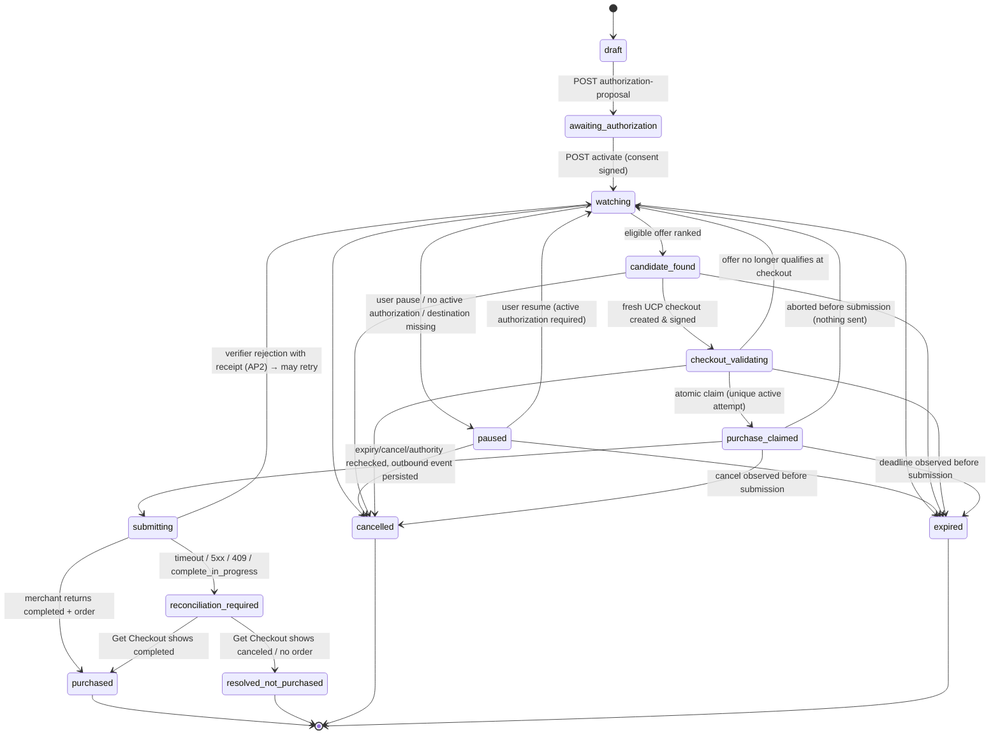
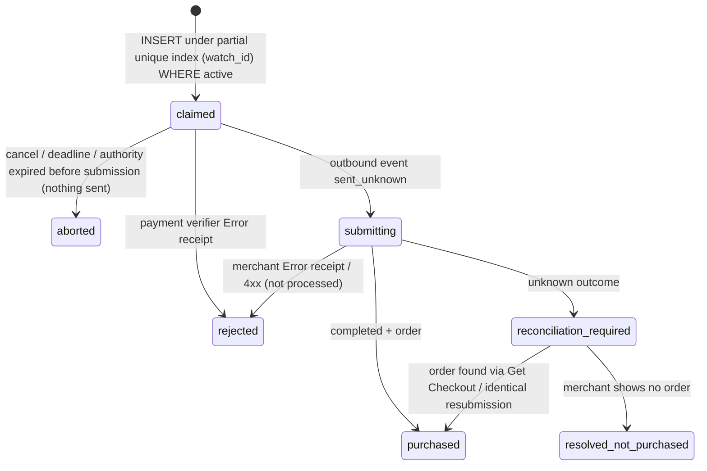

# State machines

## Watch status (`watches.status`)

Enforced by `watch_domain.states.transition`; every transition is a versioned,
lease-fenced database update and appends a `watch_events` row.



Notes

* Only `watching` is schedulable. `reconciliation_required` is worked by the reconciler, never by the poller.
* A user cancellation while `purchase_claimed | submitting | reconciliation_required` only sets `cancel_requested`; the timeline records that an order already submitted may not be cancellable.
* `resolved_not_purchased` does not reactivate authority; the authorization is marked `consumed` and new consent is required.

## Purchase attempt (`purchase_attempts.claim_state`)



Active states (`claimed, submitting, reconciliation_required, purchased`) are the
ones covered by `uq_purchase_attempts_active_claim`; a second row for the same
watch in any active state is refused by the database.

## Authorization (`authorizations.status` × `presentation_state`)

```text
status:             active ──► consumed | revoked | expired
presentation_state: idle ──► pending ──► accepted
                                  └────► rejected ──► pending (AP2 only; VI is single-use)
```

* `pending` is set inside the claim transaction and blocks any further presentation until a receipt (success or rejection) is recorded — the AP2 "no subsequent open mandate presentation without a rejection receipt" rule.
* Expiry of authority is checked at evaluation, at claim, and again immediately before external submission, always with the server clock.

## Outbound event (`outbound_events.state`)

```text
prepared ──► sent_unknown ──► acknowledged
                        └───► (stays sent_unknown until reconciliation resolves the attempt)
prepared ──► failed (4xx, definitively not processed)
```

The event (idempotency key, target, payload digest) is written **before** the
request leaves the process, so a restart can tell "never sent" from "sent, outcome unknown".

## UCP checkout session (merchant side)

```text
incomplete ⇄ requires_escalation
incomplete ──► ready_for_complete ──► completed
any non-terminal ──► canceled (cancel / expires_at)
```

Complete Checkout is accepted only from `ready_for_complete`, requires an
`Idempotency-Key`, replays the stored response for the same key + payload, and
returns `409` for the same key with a different payload or for a checkout already
completed under a different key.
